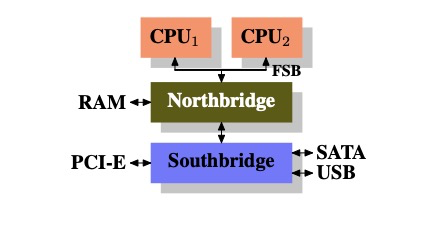
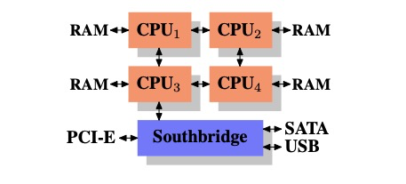
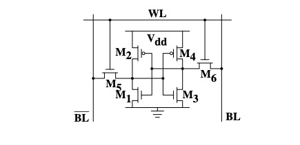
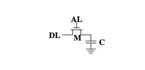
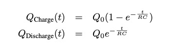
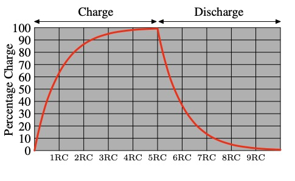
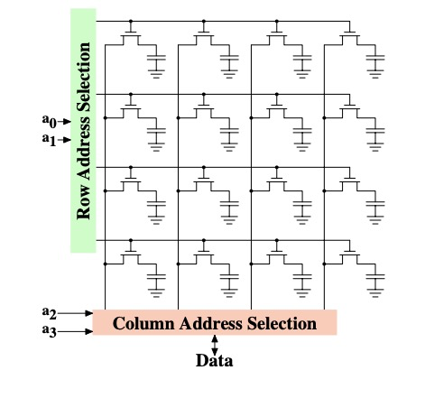

# What Every Programmer Should Know about Memory

## 简介
古早的计算机设计比较简单，系统的多种组件，例如CPU，内存，网络接口等都是在一起开发的，因此这些组件的性能也比较平衡，例如内存和网络访问在数据访问上并不会比CPU快。

这种状况在计算机基本结构完善，以及硬件开发者关注独立子系统的性能之后得到了改变，一些子系统的性能大幅落后于其他组件并成为了性能瓶颈。这一点在大容量存储以及内存上尤为突出。

大容量存储访问缓慢的问题主要通过软件技术来解决：操作系统会在主存上常驻那些最常被访问的数据，而主存会比直接访问存储会快很多。缓存也被添加到存储系统上来进一步的提升性能并不需要任何操作系统上的改动。本篇文章并不会对软件层面上的存储性能优化做过多的探讨。

不同于存储系统，避免主存成为性能瓶颈更加具有挑战性，而且几乎所有的解决方案都需要在硬件层面上做改动。如今这些改动主要以如下几种形式：

- RAM硬件设计（速度和并行层面）
- 内存控制器设计
- CPU缓存
- 设备直接内存访问（DMA）

这篇文章会主要探讨CPU缓存一级一些内存控制器设计的影响。在探索这些主题的过程中，我们会从更上层的视角介绍DMA。然而我们会先从如今商业化的硬件设计开始谈起，这是理解问题和内存系统限制的前置条件。我们同样也会在不同程度上了解不同类型的RAM并解释这些区别存在的原因。

这篇文章不会是一成不变的，而受限于商业硬件。当然我们会讨论更多的相关主题，这些细节内容推荐读者们自行了解更为详细的文档。

对于操作系统特定的细节和方案，文章仅仅描述Linux系统，并不会对其他操作系统做涉及。

在正式开始之前，文章包含大量的"一般化"以及类似的描述。文章描述的技术仅仅是针对在现实世界中最为平常，主流使用的情景。而绝对化的描述并不适用于这些技术。

## 现代商业硬件

专有的硬件在如今正在消失，因此了解现在的商业硬件非常重要。如今，计算机的扩展通常是在规模上，而不是自身上，这意味着
连接大量小型计算机而不是个别非常大和异常快速（和昂贵）的系统更具成本效益。之所以如此，是因为快速而廉价的网络硬件被广泛使用。虽然大型专业系统仍然占有一席之地，这些系统仍然提供商业机会，但整体市场与商品硬件市场相比相形见绌。截至2007年，红帽预计，对于未来产品，大多数数据中心的“标准模块”将是一台最多四个插槽的计算机，每个插槽都装满一个四核CPU，在英特尔CPU的情况下，该插槽将是超线程的。这意味着数据中心的标准系统将有多达64个虚拟处理器。大型机器将会被支持，但四插槽、四CPU核心目前被认为是最佳组合，大多数优化都是针对此类机器的。

商业硬件构建的计算机结构存在很大差异。也就是说，我们将通过专注于最重要的差异来覆盖90%以上的此类硬件。请注意，这些技术细节往往会迅速变化，因此建议读者考虑本文撰写的日期。

多年来，个人电脑和小型服务器在包含两部分的芯片组上进行了标准化：北桥和南桥。图2.1显示了这种结构。

Figure 2.1: Structure with Northbridge and Southbridge

所有CPU（图中使用了两个cpu，实际情况可能会更多）都通过公共总线（前侧总线，FSB）连接到北桥。除其他外，北桥包含内存控制器，其安装决定了用于计算机的RAM芯片的类型。不同类型的RAM，如DRAM、Rambus和SDRAM，需要不同的内存控制。

北桥必须和南桥通信才能够控制所有的系统硬件，南桥一般也被称为I/O bridge，用于处理使用各种不同类型总线进行通信的设备。其中PCI、PCI Express、SATA和USB总线最为重要，但南桥也支持PATA、IEEE 1394、串行和等位线端口。较旧的系统会把AGP插槽连接到北桥上，这样做是出于与北桥和南桥之间连接的性能原因。然而，如今PCI-E插槽都连接到南桥。

这种系统结构有许多值得注意的序列：

- 从一个CPU到另一个CPU的所有数据通信都必须通过用于与北桥通信的同一总线传输。

- 所有与RAM的通信都必须通过北桥。

- RAM只有一个端口。

- CPU和连接到南桥的设备之间的通信通过北桥路由。

在这个设计中，几个瓶颈立即显现出来。其中一个瓶颈涉及访问设备的RAM。在PC的早期，任何桥上设备的所有通信都必须通过CPU，这会对整体系统性能产生负面影响。为了解决这个问题，一些设备变得可以直接访问内存（DMA）。DMA允许设备在Northbridge的帮助下，直接在RAM中存储和重新接收数据，而无需CPU的干预（及其固有的性能成本）。如今，所有连接到任何总线的高性能设备都可以使用DMA。虽然这大大减少了CPU的工作负载，但它也为北桥的带宽产生了争用，因为DMA请求与CPU的RAM访问竞争。因此，必须考虑到这个问题。

第二个瓶颈涉及从北桥到RAM的总线。总线的实现细节取决于使用的内存类型。在旧系统上，所有RAM芯片只有一个总线，因此无法进行并行访问。最新的RAM类型需要两个独立总线（也称为DDR2通道，见第8页），这使可用带宽翻了一番。北桥在通道上交错的进行内存访问。最新的内存技术（例如FB-DRAM）增加了更多通道。

在可用带宽有限的情况下，以最小延迟的方式安排内存访问非常重要。尽管使用了CPU cache，但处理器变得越来越快以至于仍然需要等待才能进行内存访问。如果多个超线程、内核或处理器同时访问内存，则内存访问的等待时间甚至更长。即便DMA操作也是如此。

内存的访问模式比并发更为重要。访问模式本身也极大地影响了内存子系统的性能，尤其是多通道内存。在第2.2节中，我们将介绍RAM访问模式的更多详细信息。

在一些更昂贵的系统上，Northbridge实际上不包含内存控制器。相反，Northbridge可以连接到许多外部内存控制器（如下图示例中的4个MC）。

Figure 2.2: Northbridge with External Controllers

该架构的优点是存在多个内存总线，因此总可用带宽增加。这种设计还支持更多的内存。并发内存访问模式通过同时访问不同的内存库来减少延迟。当多个处理器直接连接到北桥时尤其如此，如图2.2所示。对于这样的设计，主要限制是北桥的内部带宽，这对于这个架构（来自英特尔）来说是惊人的。

使用多个外部内存控制器并不是增加内存带宽的唯一方法。另一种越来越流行的方法是将内存控制器集成到CPU中，并将内存连接到每个CPU。这种架构因基于AMD的Opteron处理器的SMP系统而广受欢迎。图2.3显示了这样一个系统。英特尔采用同样的方法，从Nehalem处理器开始支持通用系统接口（CSI），即：集成内存控制器使得每个处理器都有本地内存的可能性。

Figure 2.3: Integrated Memory Controller

有了这样的架构，可用的内存和处理器数目成正比。在四CPU机器上，内存带宽翻了两番，而不需要具有巨大带宽的复杂北桥。将内存控制器集成到CPU中有一些额外的优势；

这种架构也有缺点。首先，由于机器仍然必须使所有处理器都能访问系统的所有内存，所以内存不再统一（因此这种架构名称为NUMA: Non-Uniform Memory Architecture）。本地内存（连接到进程的内存）可以快读地访问。当访问另一个处理器的内存时，情况会有所不同。在这种情况下，必须使用处理器之间的互连。要从CPU1访问连接到CPU2的内存，需要通过一个互连进行通信。当相同的CPU访问连接到CPU4的内存时，必须交叉两个互连。

每次通过CPU互连的通信都有一定成本。对于访问远程内存所需的额外开销，我们称之为“NUMA Factor”。图2.3中的示例架构每个CPU有两种层级关系：直接相邻的CPU和一个相距两个互连的CPU。在更复杂的机器上，层级的关系可能会显著增加。还有机器架构（例如IBM的x445和SGI的Altix系列）中存在多种类型的连接。这种情况下，CPU被组织成节点；在节点内，访问内存的时间可能是均匀的，或者只有小的NUMA Factor。然而，节点之间的连接可能非常昂贵，NUMA Factor可能相当高。

商品NUMA机器如今已经量产，并可能在未来发挥更大的作用。预计从2008年底开始，每台SMP机器都将使用NUMA。NUMA所带来的开销使得了解程序如何在NUMA 机器上运行非常重要。在第5节中，我们将讨论更多的机器架构以及Linux内核为这些程序提供的一些技术。

除了本节其余部分中描述的技术细节外，还有几个影响RAM性能的其他因素。这些因素并不能够被软件所控制，因此本节并没有涵盖它们。感兴趣的读者可以在第2.1节中了解其中一些因素。这些内容只有在需要更全面地了解RAM技术时需要，并可能在购买计算机时帮助做出更好的决定。

以下两节讨论了入门级别的硬件细节以及内存控制器和DRAM芯片之间的访问协议。程序员可能会发现这些信息很有启发性，因为这些细节解释了为什么RAM访问会以这种方式工作。不过，这是可选知识，如果读者急于了解更直接相关的主题，可以跳到第2.2.5节。

### RAM 类型

多年以来，各种类型的RAM被设计制造出来，每种类型都各不相同，有时差异很大。如今只有历史学家对老旧的类型感兴趣，我们并不会探索这些细节。相反，我们将专注于现代RAM类型；我们只会停留于表面，探索一些内核或应用程序开发人员通过其性能特征可见的细节。

第一个有趣的细节是，为什么同一台机器中有不同类型的RAM的问题？。更具体地说，为什么同时存在静态RAM（SRAM）和动态RAM（DRAM）。SRAM要快得多，并提供相同的功能。为什么机器RAM并不都是SRAM？正如人们所期望的那样，答案是成本。SRAM的生产和使用成本比DRAM更加昂贵。这两个成本因素都很重要，并且第二个因素变得越来越重要。为了了解这些差异，我们需要了解SRAM和DRAM存储的一些实现。

#### 2.1.1 Static RAM(TODO)

Figure 2.4: 6-T Static RAM

图2.4显示了6个晶体管SRAM电池的结构。该电池的核心由四个晶体管M1到M4组成，它们形成两个交联逆变器。它们有两个稳定状态，分别代表0和1。只要Vdd开机可用，状态就稳定。

如果需要访问cell的状态，则字线（word line）加高电平。使得cell的状态立即可以在BL和BL上读取。如果必须覆盖单元格状态，则首先将BL和BL行设置为所需的值，然后WL加高电平。由于外部驱动器比四个晶体管（M1到M4）更强，因此允许旧状态被覆盖。

有关cell工作方式的更详细描述，请参阅[20]。对于以下讨论，重要的是要注意

- 一个电池需要六个晶体管。有四个晶体管的变体，但它们有缺点。

- 保持电池的状态需要恒定的功率。

- 一旦WL升高，几乎可以立即读取单元格状态。信号与其他晶体管控制信号一样是矩形的（在两个二进制状态之间迅速变化）。

- cell状态稳定，不需要刷新周期。

还有其他更慢、耗电较少的SRAM形式，但这些在这里不感兴趣，因为我们正在寻找快速RAM。这些缓慢的变体主要很有趣，因为它们的界面更简单，比动态RAM更容易在系统中使用。

#### 2.1.2 Dynamic RAM(TODO)

DRAM在其结构上比SRAM简单得多。图2.5显示了通常的DRAM单元设计的结构。它只由一个晶体管和一个电容器组成。当然，这种复杂性的巨大差异意味着它的功能与静态RAM非常不同。

Figure 2.5: 1-T Dynamic RAM

动态RAM单元将其状态保持在电容器C中。晶体管M用于保护对状态的访问。要读取cell的状态，访问线AL提高电平；这要么导致电流在数据线DL上流动，要么不流动，这取决于电容器中的电荷。要写入cell，数据线DL被适当设置，然后将AL升高足够长的时间，以给电容器充电或耗尽。

动态RAM的设计有很多复杂因素。电容器的使用意味着读取cell会给电容放电。该过程不能无限期重复，电容器必须在某个时候充电。更糟糕的是，为了容纳大量cell（具有10^9个或更多cell的芯片现在很常见），电容器的容量必须很低（在femto-farad范围内或更低）。一个带电的电容包含几十万个电子。尽管电容器的电阻很高（几个太欧姆），但容量耗散的时间很短。这个问题被称为“泄漏”。

这种泄漏是DRAM单元必须不断刷新的原因。如今，对于大多数DRAM芯片来说，这种刷新必须每64毫秒一次。在刷新周期中，无法访问内存，因为刷新只是丢弃结果的内存读取操作。对于某些工作负载，此开销可能会阻止高达50%的内存访问.

微小电荷导致的第二个问题是，从cell中读取的信息无法直接使用。数据线必须连接到感应放大器，该放大器可以区分在整个电荷范围内存储的0或1，这些电荷仍然必须算作1。

第三个问题是，读取电池会导致电容器的电荷耗尽。这意味着每次读取操作后都必须进行电容器充电的操作。这是通过将感应放大器的输出反馈回电容器来自动完成的。然而，这确实意味着阅读记忆内容需要额外的能量，更重要的是，时间。

第四个问题是，充电和排出电容不是即时的。感应放大器接收的信号不是矩形的，因此必须使用一个保守的预估来了解单元的输出何时可用。电容器充电和放电的公式是

这意味着电容器需要一些时间（由电容C和电阻R决定）才能充电和放电。这也意味着感应放大器可以检测到的电流不能立即可用。图2.6显示了电荷和放电曲线。X轴以RC（电阻多电容）的单位来测量，RC是一个时间单位。

Figure 2.6: Capacitor Charge and Discharge Timing

与静态RAM情况不同，当WL升高时，输出立即可用，DRAM总是需要一些时间，直到电容器充分放电。这种延迟严重限制了DRAM的速度。

简单的方法也有其优点。主要优势是尺寸。一个DRAM cell所需的芯片空间比SRAM小很多倍。SRAM cell还需要单独的功率来维持状态的晶体管。DRAM cell的结构也更简单、更规则，这意味着在模具上将其中许多cell紧密包装在一起更简单。

总体而言，成本的（相当戏剧性的）差异获胜。例如，在专门的硬件——例如，网络路由器——我们必须使用基于DRAM的主内存。这对程序员有巨大的影响，我们将在本文的其余部分讨论。但首先，我们需要研究一些关于DRAM单元实际使用的更多细节。

#### 2.1.3 DRAM Access

程序使用虚拟地址选择内存位置。处理器将此转换为物理地址，最后内存控制器选择与该地址对应的RAM芯片。物理地址的部分以多个地址行的形式传递用以在RAM芯片上选择独立的内存单元，

从内存控制器单独寻址内存位置是完全不切实际的：4GB的RAM需要2^32个地址行。相反，地址使用一组较小的地址行编码为二进制数字。通过这种方式传递给DRAM芯片的地址必须首先进行多路复用。具有N个地址线的分解器将有2^N输出线。这些输出行可用于选择内存单元。对于容量小的芯片来说，使用这种直接方法不大问题。

但如果cell数量增长，这种方法就不再合适了。具有1Gbit（2^ 30）容量的芯片需要30条地址线和2^30条选择线。当不牺牲速度时，多路复用器的大小会随着输入行数的指数增长而增加。除了复用器的复杂性（大小和时间）外，30条地址线的分解器还需要大量的芯片面积。更为重要的是，传输地址线上的30个脉冲同步比“仅”传输15个脉冲要难得多。更少的行必须以完全相同的长度排列或适当计时

Figure 2.7: Dynamic RAM Schematic

图2.7概括了DRAM芯片结构。DRAM cell按行和列组织。这些cell也可以排成一行，但这样就会使得DRAM需要一个巨大的分解器。使用矩阵排列的方式，设计可以使用一个分解器和一个一半大小的多路复用器。这在各方面都节省了资源。在示例中，地址行a0和a1通过行地址选择（RAS）分解器 选择整行cell的地址行。因此，在读取时，所有cell的内容都可用于列地址选择（CAS）多路复用器。根据地址行a2和a3，然后将一个列的内容提供给DRAM的数据引脚。这一过程在多个DRAM上并行多次，从而产生与数据总线宽度相对应的总位数。
